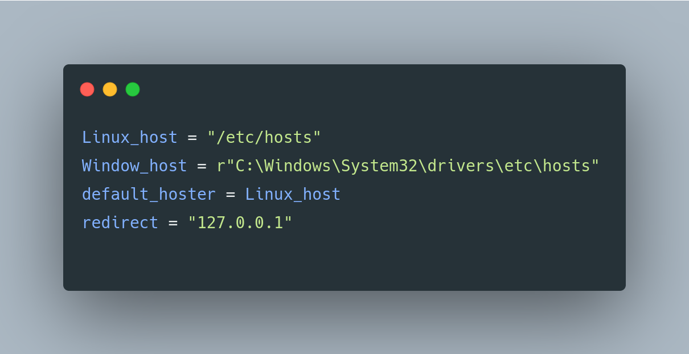
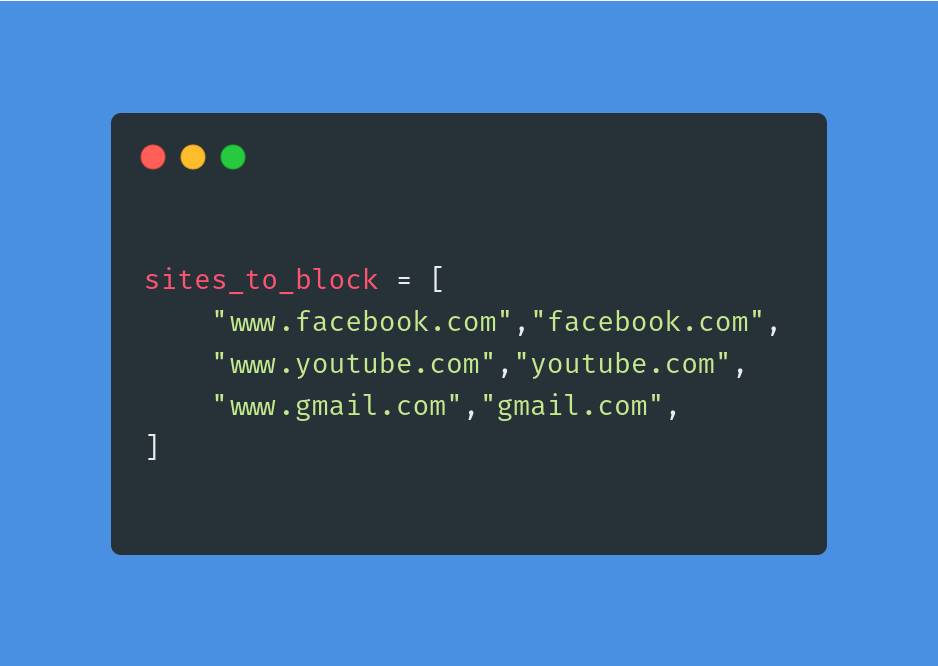
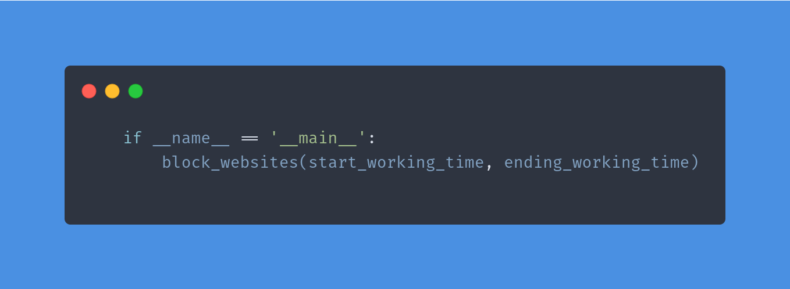

<div align="center">

# 🚫 BlockSite – Website Blocker Python

### A simple Python automation project that blocks distracting websites during work or study hours.


</div>

---

## 👥 Team Members

<div align="center">

| Name | Roll Number |
|---|---|
| Abhishek Kumar Kalaujiya | 2407370130002 |
| Abhishek Rao | 2407370130004 |
| Anikesh Kumar | 2407370130016 |
| Prince Kannaujiya | 2407370130046 |
| Saransh Sonkar | 2407370130056 |
| Vishnu Pratap Singh | 2407370130069 |
| Yogendra | 2407370130070 |

</div>

<p align="center">
<b>B.Tech IT — <a href="https://recabn.ac.in/">Rajkiya Engineering College, Ambedkar Nagar</a></b>
</p>

---

# 📌 Overview

BlockSite is a Python-based website blocker designed to improve productivity by restricting access to distracting websites during working or study hours.

The project works by modifying the system hosts file and redirecting selected websites to the localhost address (`127.0.0.1`).

---

# ⚙️ Technologies Used

- Python
- File Handling
- Datetime Module
- OS Module

---

# 🧠 How it Works

The script redirects blocked websites to:

```txt
127.0.0.1
```

Example:

```txt
127.0.0.1 facebook.com
```

This prevents the browser from accessing the real website.

The websites are automatically unblocked after working hours.

---

# 🖼️ Project Images

## Hosts File Location

<p align="center">
  
</p>

---

## Websites to Block

<p align="center">
  
</p>

---

## Setting Working Hours

<p align="center">
  
</p>

---

# 🌐 Websites to Block

Open `app.py` and edit:

```python
sites_to_block = [
    "facebook.com",
    "youtube.com",
    "instagram.com"
]
```

---

# ⏰ Setting Working Hours

Edit the last line in `app.py`:

```python
block_websites(9, 21)
```

This blocks websites from 9 AM to 9 PM.

---

# 💻 Hosts File Locations

### Windows

```txt
C:\Windows\System32\drivers\etc\hosts
```

### Linux

```txt
/etc/hosts
```

---

# 🚀 Getting Started

Clone the repository:

```bash
git clone https://github.com/dark-shadowblade/BlockSite.git
cd BlockSite
```

Run the script:

```bash
python app.py
```

---

# 📂 Project Structure

```text
BlockSite/
│
├── app.py
├── app v2.py
├── README.md
├── host_file_location.png
├── site_to_block.png
└── time_to_block.png
```

---

# 📌 Note

Run the script as Administrator because modifying the hosts file requires system permission.

---

# 📖 Conclusion

BlockSite demonstrates practical use of Python automation and file handling by controlling website access through hosts file modification.
